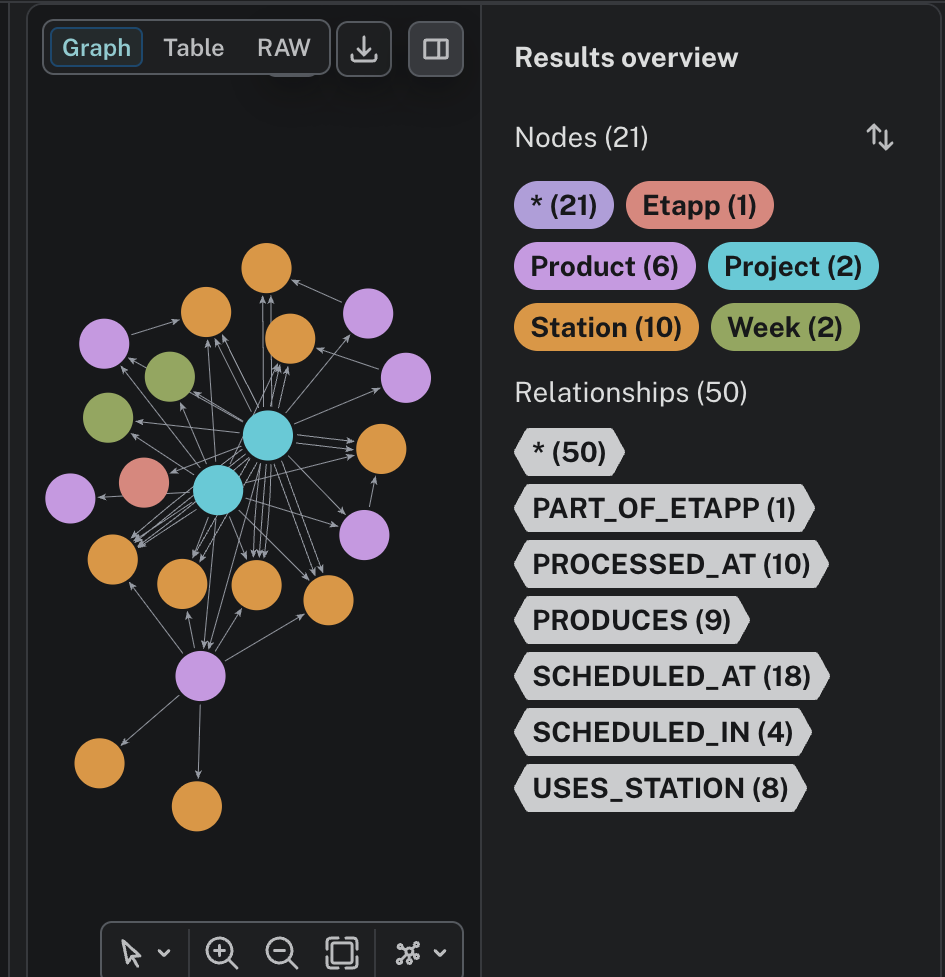

# Factory Knowledge Graph Dashboard

A Streamlit + Neo4j dashboard for analyzing factory production planning, staffing coverage, station overloads, and capacity bottlenecks.

## Features

- Project variance tracking
- Production station load analysis
- Capacity deficit monitoring
- Worker coverage analysis
- Graph-based operational insights
- Self-test validation system

## Tech Stack

- Neo4j AuraDB
- Streamlit
- Plotly
- pandas
- Python

## Dataset

The dashboard uses:
- factory_production.csv
- factory_workers.csv
- factory_capacity.csv

## Run Locally

```bash
pip install -r requirements.txt
streamlit run app.py
```

## Neo4j Configuration

Create `.streamlit/secrets.toml`

```toml
NEO4J_URI = "your-uri"
NEO4J_USER = "neo4j"
NEO4J_PASSWORD = "your-password"
```

## Graph Visualization



## Graph Architecture

### Node Labels
- Project
- Product
- Station
- Worker
- Certification
- Week

### Relationship Types
- SCHEDULED_AT
- USES_STATION
- CAN_COVER
- HAS_CERTIFICATION
- ASSIGNED_TO